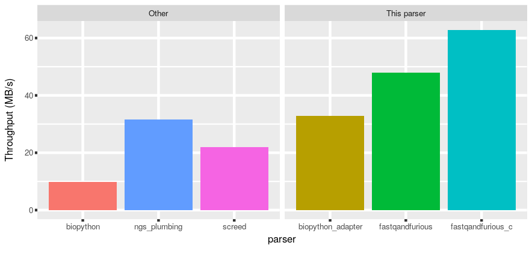

# fastq-and-furious

(... because it turned out that the performance bottleneck for an
[algorithm-focused implementation of bottom-sketches (MinHash sketches)](https://github.com/lgautier/mashing-pumpkins)
was the parsing of FASTQ files).

[](https://travis-ci.org/lgautier/fastq-and-furious)

Efficient handling of FASTQ files(*) from Python ( *: no multi-line FASTQ though, in which case an exception will be raised when parsing).

[](throughput.png)


## Installation

Python >= 3.5 (with headers) and a C99-compliant compiler are the only requirements.

```bash

pip install git+https://github.com/lgautier/fastq-and-furious.git

```

Should C extensions be unavaible (no C compiling possible, Pypy, other reasons), the Python-only version can still be used
(see section Performance below).


To run the tests after installation, one will need a clone of the repository. From the root of the repository, run:

```bash

python -m pytest --cov=fastqandfurious --cov-report xml --cov-report term tests.py

```

If `coverage` is not installed / is not working for you, the tests can be run without coverage analysis with:

```bash

python -m pytest tests.py

```

## Performance

There is a little utility to try it out on your own systems and files (there are options,
available with the flag `--help`).

The two mode are "speed" and "compare", the former benchmarking the speed of different
parsers and the second comparing the output of different parsers (not so good to be
fast if not correct).

### Speed

```bash

python -m fastqandfurious.demo.benchmark speed <FASTQ or FASTQ.gz or FASTQ.bz2 or FASTQ.lzma file>

```

Note that third-party library parsing FASTQ files are required in order to be able to run the full
benchmark.

With a gzip-compressed FASTQ file of 60MB (size compressed) with 273,639 entries,
the benchmark is
(the throughput is for the DNA sequences in the file - headers and quality strings
are not counted):


| parser | throughput | notes |
|---|---|---|
| screed | 23.27MB/s ||
| biopython | 10.18MB/s ||
| biopython_adapter | 33.26MB/s | fastqandfurious creating biopython objects |
| ngs_plumbing | 32.98MB/s ||
| fastqandfurious | 51.27MB/s | pure python |
| fastqandfurious_c | 67.38MB/s | parsing individual entries with C extension |


With a gzip-compressed FASTQ file of 700MB (size compressed) with 20,853,696 entries,
the benchmark is
(the throughput is for the DNA sequences in the file - headers and quality strings
are not counted):


| parser | throughput |
|---|---|
| screed | 3.63MB/s |
| biopython | 3.57MB/s |
| biopython_adapter | 6.19MB/s |
| ngs_plumbing | 5.77MB/s |
| fastqandfurious | 11.51MB/s |
| fastqandfurious_c | 21.88MB/s |


### Compare

To compare the output of two parsers, for example `biopython` and our parser:

```bash

python -m fastqandfurious.demo.benchmark compare biopython fastqandfurious <FASTQ | FASTQ.gz | FASTQ.bz2 | FASTQ.lzma>

```

## Documentation

The documentation is currently a little sparse. The docstring
for `fastqandfurious.fastqandfurious.readfastq_iter()` is a good starting point.
The code for the benchmark (see below) is also a good source of information as
it can show how to use when compared to other parsers benchmarked.

### Short short doc

In a nutshell, the reader takes a file-like object, a buffersize (number of bytes),
and a function called when yielding entries (to produce "entry" objects):

```python

from fastqandfurious import fastqandfurious, entryfunc

bufsize = 20000
with open("a/fastq/file.fq") as fh:
    it = fastqandfurious.readfastq_iter(fh, bufsize, entryfunc)
    for sequence in it:
        # do something
	pass
```

That design allows to decouple decompression from parsing. Reading data from a gzip-compressed
file is working the same:

```python
import gzip
with gzip.open("a/fastq/file.fq") as fh:
    it = fastqandfurious.readfastq_iter(fh, bufsize, entryfunc)
    for entry in it:
        # do something
	pass
```

### Instant faster code (just add <strike>water</strike> adapter code)

That design also lets us just drop the parser into an existing code base, or keep working
with a library you are most familiar with, writing a short adapter (and observe
immediate performance gains - see benchmark below).

For biopython, it could look like:

```python
from fastqandfurious import fastqandfurious
from Bio.SeqRecord import SeqRecord

def biopython_entryfunc(buf, posarray):
    name = buf[posarray[0]:posarray[1]].decode('ascii')
    entry = SeqRecord(seq=buf[posarray[2]:posarray[3]].decode('ascii'),
                      id=name,
                      name=name)
    return entry

bufsize = 20000
with open("a/fastq/file.fq") as fh:
    it = fastqandfurious.readfastq_iter(fh, bufsize, biopython_entryfunc)
    for entry in it:
        # do something
	pass

```

The design is obviously also offering various performance gains by allowing to only build entry components
as needed. For example, writing a filter on read length could be done with:

```python
def lengthfilter_entryfunc(buf, posarray):
    LENGTH_THRESHOLD = 25
    if posarray[3] - posarray[2] < LENGTH_THRESHOLD:
        return buf[posarray[2]:posarray[3]]
    else:
        return None

with open("a/fastq/file.fq") as fh:
    it = fastqandfurious.readfastq_iter(fh, bufsize, lengthfilter_entryfunc)
    for sequence in it:
        if sequence is None:
	    # do nothing
	else:
            # do something
	    pass

```


