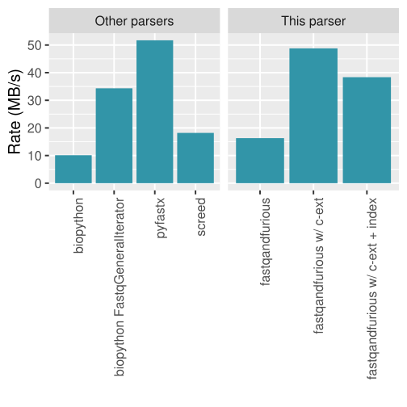

# fastq-and-furious

(... because it turned out that the performance bottleneck for an
[algorithm-focused implementation of bottom-sketches (MinHash sketches)](https://github.com/lgautier/mashing-pumpkins)
was the parsing of FASTQ files).

Project web page: [https://lgautier.github.io/fastq-and-furious/](https://lgautier.github.io/fastq-and-furious/)

Efficient and flexible parsing of FASTQ files(*) from Python. It is about as fast as the fastest parser with C extensions, but it is substantially more flexible.

